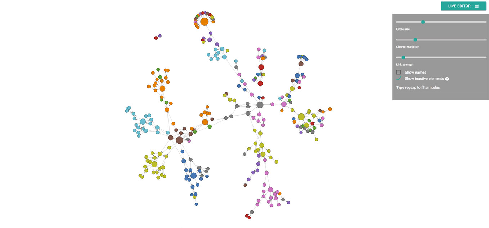
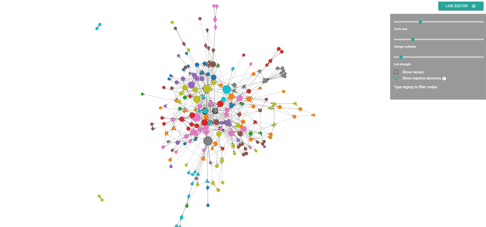

[](https://github.com/alexzaitsev/apk-dependency-graph/releases/tag/0.0.5) [](http://android-arsenal.com/details/1/4411)

Android dependency visualizer. It's tool that helps to visualize current state of your project. It's really easy to see how tight your classes are coupled.

## Theory
Class coupling is one of the significant code metrics which shows how easy is to change your code. Actually the architecture of microservices is based on the idea that the modules should be low-coupled so you are able to easily replace one module with another one with the same interface. This tool helps to view whole picture of your project. Check yourself!

## Requirements
You need at least **Java 7** to run `jar` files.

## Usage
### Fast way
I've prepared helpful scripts for you. All you need to do is to clone this repository (or download and unpack release archive) and type the next command in your command line:  
*For Windows*:
```
run.bat full\path\to\the\apk\app-release.apk com.example.test
```
where `run.bat` is a path to script in your local repository, `full\path\to\the\apk\app-release.apk` is a full path to the apk file you want to analize, `com.example.test` is a filter. **We recommend to use your package name as a filter so you will avoid unnecessary dependencies in your graph. If you don't want to filter just pass `nofilter`.**  
*For Unix*:
```
./run.sh full/path/to/the/apk/app-release.apk com.example.test
```
Wait until the command finishes:
```
I: Using Apktool 2.2.0 on app-release.apk
I: Loading resource table...
I: Decoding AndroidManifest.xml with resources...
I: Loading resource table from file: C:\Users\username\AppData\Local\apktool\framework\1.apk
I: Regular manifest package...
I: Decoding file-resources...
I: Decoding values */* XMLs...
I: Baksmaling classes.dex...
I: Copying assets and libs...
I: Copying unknown files...
I: Copying original files...
Success! Now open index.html in your browser.
```
It will decompile your apk and create apk-file-name folder in the same folder where the script is. After this it will analyze the smali code and generate `analyzed.js` file which contains all dependencies.   
**Now open `index.html` in your browser and enjoy!**
### Long way
If you don't want to use `run` scripts you can do all the stuff from the command line by yourself.  
Firsly, decompile your apk with the `apktool` jar:  
```
java -jar apktool_2.2.0.jar d path-to-apk.apk -o path-to-folder-with-decompiled-files -f
```
After this run `analyzer`:  
```
java -jar apk_dependency_graph_0.0.5.jar -i path-to-folder-with-decompiled-files -o analyzed.js -f com.example.test
```
I suggest to use your package name as filter. If you don't want to filter just pass `nofilter`.

## Examples

Here the sample of good architecture with low class coupling:  


And this one looks like a spaghetti:  


Does your project look like the first or the second picture? :)

## Demo

Watch [demo video](https://www.youtube.com/watch?v=rw501tvT4ko).

## Hashtag
Share your awesome architecture using `#apkdependencyvizualizer` hashtag!

## Troubleshooting

Aware! **This tool cannot analyze apks generated with enabled instant run feature**. This is a limitation of `apktool` running under the hood.  
If you have troubles look through [troubleshooting](https://github.com/alexzaitsev/apk-dependency-graph/wiki/Troubleshooting) wiki page or create an issue in this repository.

## Credits

There is the same tool for iOS: https://github.com/PaulTaykalo/objc-dependency-visualizer   
I use `index.html` of that project. Thanks Paul for the great tool.
